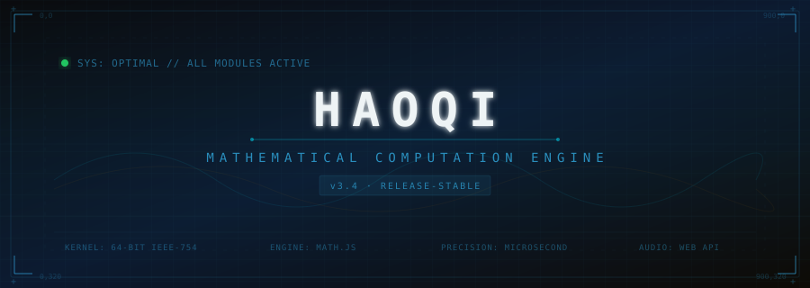
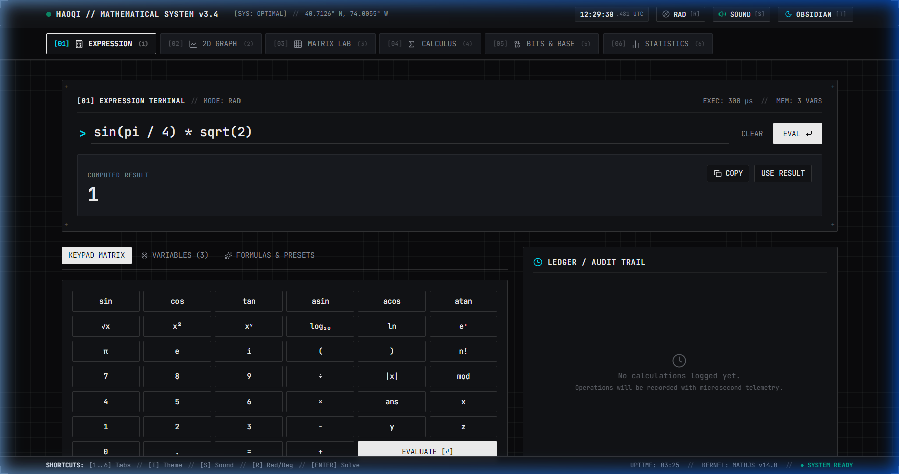
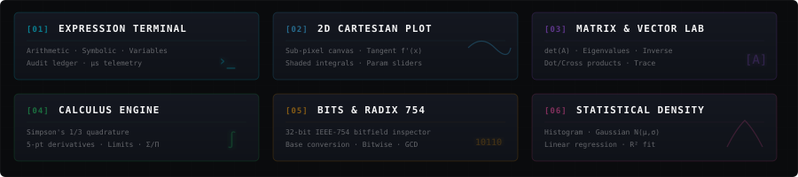
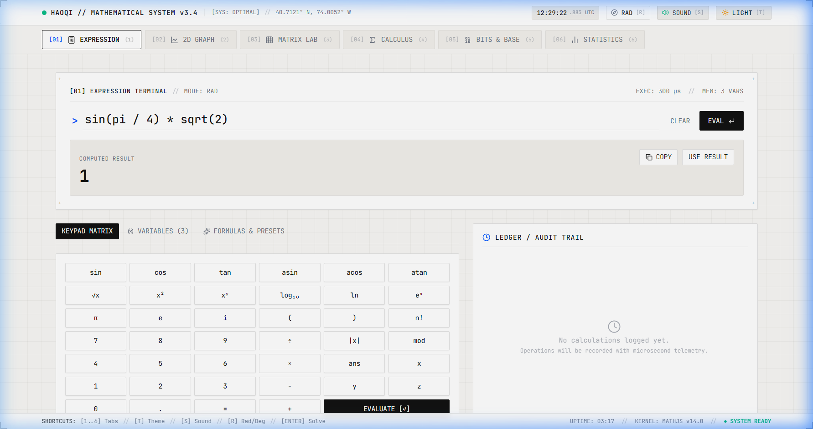
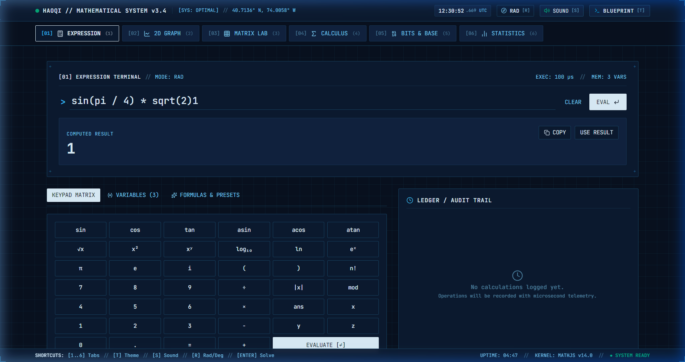
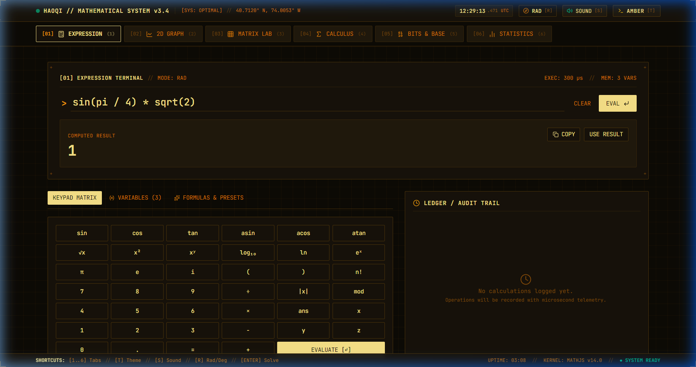
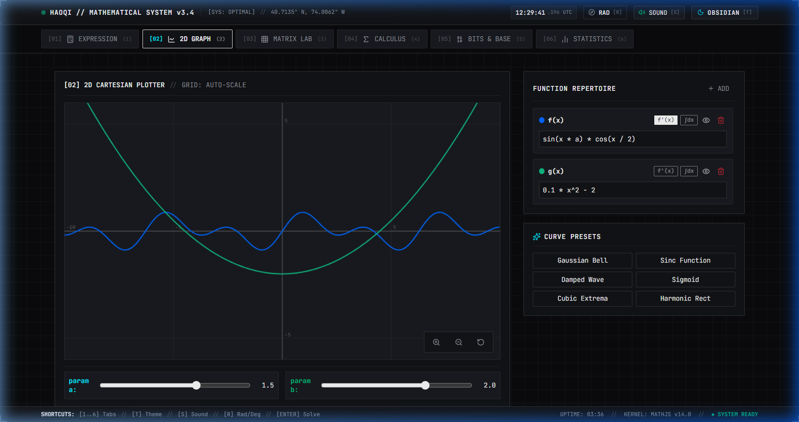
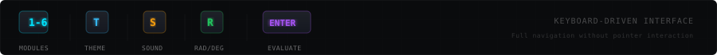

<!-- ═══════════════════════════════════════════════════════════════════════════ -->
<!-- HAOQI // MATHEMATICAL COMPUTATION ENGINE — README                        -->
<!-- ═══════════════════════════════════════════════════════════════════════════ -->

<div align="center">

<!-- ▸ ANIMATED HEADER BANNER ────────────────────────────────────────────── -->



<br/>

<!-- ▸ STATUS BADGES ─────────────────────────────────────────────────────── -->

<picture>
  
</picture>
&nbsp;
<picture>
  
</picture>
&nbsp;
<picture>
  
</picture>
&nbsp;
<picture>
  
</picture>
&nbsp;
<picture>
  
</picture>

<br/><br/>

> *A high-precision retro-futurist mathematical computation and visual analysis workspace*
> *inspired by the tactile, monospace-driven design language of **[haoqi.design](https://haoqi.design/)***

<br/>

</div>

<!-- ▸ SECTION DIVIDER ───────────────────────────────────────────────────── -->


<!-- ═══════════════════════════════════════════════════════════════════════════ -->
## <samp>&nbsp;⌖&nbsp;LIVE PREVIEW&nbsp;</samp>
<!-- ═══════════════════════════════════════════════════════════════════════════ -->

<div align="center">

<!-- ▸ HERO SCREENSHOT — OBSIDIAN THEME ──────────────────────────────────── -->

<br/>

<picture>
  
</picture>

<sub><kbd>&nbsp; OBSIDIAN TERMINAL &nbsp;</kbd>&nbsp;&nbsp;Deep space console with cyan emissive lines</sub>

<br/><br/>

</div>

<!-- ▸ SECTION DIVIDER ───────────────────────────────────────────────────── -->


<!-- ═══════════════════════════════════════════════════════════════════════════ -->
## <samp>&nbsp;⌖&nbsp;DESIGN PHILOSOPHY&nbsp;</samp>
<!-- ═══════════════════════════════════════════════════════════════════════════ -->

<br/>

<table>
<tr>
<td width="25%" align="center">
<br/>
<samp><b>MONOSPACE GRID</b></samp><br/><br/>
<sub>Built with <code>JetBrains Mono</code> &amp;<br/><code>Space Mono</code> tabular numerals.<br/>Every pixel on a 24px grid.</sub>
<br/><br/>
</td>
<td width="25%" align="center">
<br/>
<samp><b>TACTILE AUDIO</b></samp><br/><br/>
<sub>Real-time synthesized clicks,<br/>harmonic major-triad chimes,<br/>and frequency sweep oscillators.</sub>
<br/><br/>
</td>
<td width="25%" align="center">
<br/>
<samp><b>PLATE LAYERING</b></samp><br/><br/>
<sub>Fine <code>1px</code> borders, corner<br/>registration marks (<code>+</code>),<br/>and technical crosshair tracking.</sub>
<br/><br/>
</td>
<td width="25%" align="center">
<br/>
<samp><b>GLYPH DECODE</b></samp><br/><br/>
<sub>Characters decrypt into place<br/>using pseudo-random glyph<br/>cycles upon state transition.</sub>
<br/><br/>
</td>
</tr>
</table>

<br/>

<!-- ▸ SECTION DIVIDER ───────────────────────────────────────────────────── -->


<!-- ═══════════════════════════════════════════════════════════════════════════ -->
## <samp>&nbsp;⌖&nbsp;COMPUTATION MODULES&nbsp;</samp>
<!-- ═══════════════════════════════════════════════════════════════════════════ -->

<br/>

<div align="center">

</div>

<br/>

<details>
<summary><kbd>&nbsp; [01] EXPRESSION TERMINAL &nbsp;</kbd>&nbsp;&nbsp;⟶&nbsp;&nbsp;<sub>Click to expand technical details</sub></summary>
<br/>

- Evaluates complex expressions, trigonometric entities, exponentials, roots, modulo, and factorials
- Supports exact rational fraction reduction (e.g., $0.707106... \to \sqrt{2}/2$)
- Dynamic memory variables (`x = 42`, `radius = 12.5`, `ans`)
- Audit ledger logging computation durations in microseconds ($\mu\text{s}$)

</details>

<details>
<summary><kbd>&nbsp; [02] 2D CARTESIAN PLOT &nbsp;</kbd>&nbsp;&nbsp;⟶&nbsp;&nbsp;<sub>Click to expand technical details</sub></summary>
<br/>

- Real-time panning and mouse-wheel zooming with auto-scaling grid divisions
- Dynamic tangent line visualizer rendering the instantaneous derivative $f'(x)$ at cursor position
- Shaded definite integral bounding between custom lower and upper limits
- Real-time coefficient sliders ($a, b$) for parametric curve tuning

</details>

<details>
<summary><kbd>&nbsp; [03] MATRIX & VECTOR LAB &nbsp;</kbd>&nbsp;&nbsp;⟶&nbsp;&nbsp;<sub>Click to expand technical details</sub></summary>
<br/>

- Arbitrary $2\times 2$, $3\times 3$, and $4\times 4$ matrix operations
- Determinants $\det(A)$, Trace $\text{tr}(A)$, Transpose $A^T$, and Matrix Inversion $A^{-1}$
- Eigenvalue solving for linear transformations
- 3D Vector engine: dot products $\mathbf{u}\cdot\mathbf{v}$, magnitudes $\|\mathbf{u}\|$, angle $\theta$, cross products $\mathbf{u}\times\mathbf{v}$

</details>

<details>
<summary><kbd>&nbsp; [04] CALCULUS ENGINE &nbsp;</kbd>&nbsp;&nbsp;⟶&nbsp;&nbsp;<sub>Click to expand technical details</sub></summary>
<br/>

- **Numerical Integration**: Adaptive Simpson's $1/3$ quadrature rule:
  $$\int_{a}^{b} f(x)\,dx \approx \frac{h}{3} \left[ f(a) + 4\sum f(x_{\text{odd}}) + 2\sum f(x_{\text{even}}) + f(b) \right]$$
- **Differentiation**: High-order 5-point stencil central difference for $f'(x_0)$ and curvature $f''(x_0)$
- **Discrete Series**: Arbitrary finite summation $\sum_{n=a}^b f(n)$ and product $\prod_{n=a}^b f(n)$
- **Limits**: Two-sided numerical convergence tables approaching critical points ($\delta \to 0$)

</details>

<details>
<summary><kbd>&nbsp; [05] BITS & IEEE-754 &nbsp;</kbd>&nbsp;&nbsp;⟶&nbsp;&nbsp;<sub>Click to expand technical details</sub></summary>
<br/>

- Interactive 32-bit floating point bitfield: click individual bits to flip sign ($1\text{b}$), exponent ($8\text{b}$), or mantissa ($23\text{b}$)
- Real-time base conversion between Decimal, Hexadecimal, Binary, and Octal
- Bitwise logic gates (`AND`, `OR`, `XOR`, `NOT`, bit shifts `<<`, `>>`)
- Prime factorization, Greatest Common Divisor ($\gcd$), and Least Common Multiple ($\text{lcm}$)

</details>

<details>
<summary><kbd>&nbsp; [06] STATISTICS & DENSITY &nbsp;</kbd>&nbsp;&nbsp;⟶&nbsp;&nbsp;<sub>Click to expand technical details</sub></summary>
<br/>

- Descriptive statistics ($\mu$, median, sample variance $\sigma^2$, standard deviation $\sigma$, $\text{IQR}$)
- Auto-binned histogram with overlaid Gaussian probability density function $N(\mu, \sigma)$
- Least-squares linear regression solver ($y = mx + b$) with $R^2$ goodness-of-fit percentage

</details>

<br/>

<!-- ▸ SECTION DIVIDER ───────────────────────────────────────────────────── -->


<!-- ═══════════════════════════════════════════════════════════════════════════ -->
## <samp>&nbsp;⌖&nbsp;THEMES &amp; ATMOSPHERES&nbsp;</samp>
<!-- ═══════════════════════════════════════════════════════════════════════════ -->

<br/>

<div align="center">

</div>

<br/>

<!-- ▸ THEME SCREENSHOT GALLERY ──────────────────────────────────────────── -->

<div align="center">
<table>
<tr>
<td width="50%" align="center">
<br/>
<picture>
  
</picture>
<br/>
<sub><kbd>&nbsp; TECHNICAL LIGHT &nbsp;</kbd></sub>
<br/><br/>
</td>
<td width="50%" align="center">
<br/>
<picture>
  
</picture>
<br/>
<sub><kbd>&nbsp; OBSIDIAN TERMINAL &nbsp;</kbd></sub>
<br/><br/>
</td>
</tr>
<tr>
<td width="50%" align="center">
<br/>
<picture>
  
</picture>
<br/>
<sub><kbd>&nbsp; BLUEPRINT &nbsp;</kbd></sub>
<br/><br/>
</td>
<td width="50%" align="center">
<br/>
<picture>
  
</picture>
<br/>
<sub><kbd>&nbsp; AMBER PHOSPHOR &nbsp;</kbd></sub>
<br/><br/>
</td>
</tr>
</table>
</div>

<br/>

<div align="center">

<picture>
  
</picture>

<sub><kbd>&nbsp; 2D CARTESIAN PLOTTER &nbsp;</kbd>&nbsp;&nbsp;Multi-function graphing with parametric sliders</sub>

</div>

<br/>

<!-- ▸ SECTION DIVIDER ───────────────────────────────────────────────────── -->


<!-- ═══════════════════════════════════════════════════════════════════════════ -->
## <samp>&nbsp;⌖&nbsp;KEYBOARD PROTOCOL&nbsp;</samp>
<!-- ═══════════════════════════════════════════════════════════════════════════ -->

<br/>

<div align="center">

</div>

<br/>

> The entire application can be driven via keyboard commands without pointer interaction.
> Press <kbd>T</kbd> to cycle themes, <kbd>1</kbd>–<kbd>6</kbd> to switch modules, <kbd>S</kbd> to toggle synthesizer audio, <kbd>R</kbd> to switch angle units, and <kbd>Enter</kbd> to evaluate.

<br/>

<!-- ▸ SECTION DIVIDER ───────────────────────────────────────────────────── -->


<!-- ═══════════════════════════════════════════════════════════════════════════ -->
## <samp>&nbsp;⌖&nbsp;TECH STACK&nbsp;</samp>
<!-- ═══════════════════════════════════════════════════════════════════════════ -->

<br/>

<div align="center">

</div>

<br/>

<!-- ▸ SECTION DIVIDER ───────────────────────────────────────────────────── -->


<!-- ═══════════════════════════════════════════════════════════════════════════ -->
## <samp>&nbsp;⌖&nbsp;QUICK START&nbsp;</samp>
<!-- ═══════════════════════════════════════════════════════════════════════════ -->

<br/>

```bash
# ── Clone the workspace ──────────────────────────────────────────
git clone https://github.com/Sairaj213/haoqi-mathematical-engine.git
cd haoqi-mathematical-engine

# ── Install dependencies ─────────────────────────────────────────
npm install

# ── Launch the development server ────────────────────────────────
npm run dev

# ── Build for production ─────────────────────────────────────────
npm run build
```

<br/>

<!-- ▸ SECTION DIVIDER ───────────────────────────────────────────────────── -->


<!-- ═══════════════════════════════════════════════════════════════════════════ -->
## <samp>&nbsp;⌖&nbsp;PROJECT STRUCTURE&nbsp;</samp>
<!-- ═══════════════════════════════════════════════════════════════════════════ -->

<br/>

```
haoqi-mathematical-engine/
├── src/
│   ├── components/
│   │   ├── ExpressionView.tsx    ── [01] Expression & Symbolic Engine
│   │   ├── GraphView.tsx         ── [02] 2D Cartesian Function Plotter
│   │   ├── MatrixView.tsx        ── [03] Matrix & Linear Algebra Lab
│   │   ├── CalculusView.tsx      ── [04] Calculus & Limits Engine
│   │   ├── BaseBitsView.tsx      ── [05] IEEE-754 Bits Inspector
│   │   ├── StatsView.tsx         ── [06] Statistics & Regression
│   │   ├── Header.tsx            ── System header & theme controls
│   │   ├── Navigation.tsx        ── Module tab navigation
│   │   └── TactileButton.tsx     ── Reusable tactile button component
│   ├── utils/
│   │   └── audio.ts              ── Web Audio API synthesizer engine
│   ├── App.tsx                   ── Root application with keyboard protocol
│   ├── index.css                 ── Theme system & CSS custom properties
│   ├── main.tsx                  ── Application entry point
│   └── types.ts                  ── TypeScript type definitions
├── assets/                       ── SVG visuals & screenshots
├── index.html                    ── HTML shell
├── vite.config.ts                ── Vite build configuration
├── tsconfig.json                 ── TypeScript configuration
└── package.json                  ── Dependencies & scripts
```

<br/>

<!-- ═══════════════════════════════════════════════════════════════════════════ -->

<div align="center">


</div>
